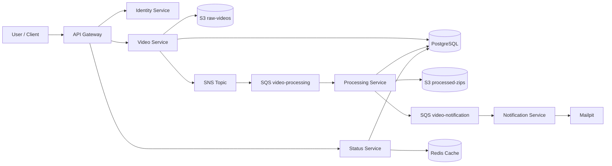

# FIAP 13SOAT Tech Challenge 5 - Monorepo

Event-driven microservices platform for video upload and asynchronous processing, built with Hexagonal Architecture, tactical DDD, and AWS-style messaging patterns.

## Table of Contents

- [Overview](#overview)
- [Main Features](#main-features)
- [Architecture](#architecture)
- [Services](#services)
- [Tech Stack](#tech-stack)
- [Project Structure](#project-structure)
- [Local Environment Setup](#local-environment-setup)
- [How to Test](#how-to-test)
- [API and End-to-End Flow](#api-and-end-to-end-flow)
- [Observability](#observability)
- [Reliability, Scalability, and Security](#reliability-scalability-and-security)
- [Troubleshooting](#troubleshooting)
- [Documentation and Diagrams](#documentation-and-diagrams)

## Overview

The platform receives a video upload, stores metadata and binary content, dispatches asynchronous processing through queues, generates a ZIP output, tracks processing state, and sends notifications.

It is organized as a monorepo with isolated services and a shared package for contracts, utilities, and observability helpers.

## Main Features

- User registration, login, refresh token, and logout.
- JWT authentication with role-aware access patterns.
- Video upload through API Gateway.
- Asynchronous video processing pipeline using SQS/SNS.
- Status query and processing history.
- Processed ZIP download when status is `COMPLETED`.
- Notification dispatch to Mailpit in local environment.
- Built-in health endpoints and telemetry support.

## Architecture

This solution applies:

- Hexagonal Architecture in each service.
- Tactical DDD for entities and domain events.
- Event-Driven Architecture (EDA) with queue-based decoupling.
- Lightweight CQRS split for write and read responsibilities in status/history queries.

High-level flow:



## Services

- `fiap-13soat-techchallenge-5-api-gateway`: single entry point, routing, and auth enforcement.
- `fiap-13soat-techchallenge-5-identity-service`: authentication, token lifecycle, and user identity.
- `fiap-13soat-techchallenge-5-video-service`: video upload handling, metadata persistence, and event publication.
- `fiap-13soat-techchallenge-5-processing-service`: queue consumption, video processing, ZIP generation, and status updates.
- `fiap-13soat-techchallenge-5-status-service`: status lookup, history retrieval, cache-assisted reads, and ZIP download link handling.
- `fiap-13soat-techchallenge-5-notification-service`: notification queue consumer and email dispatch.

## Tech Stack

- Node.js LTS
- TypeScript
- Fastify
- PostgreSQL
- Redis
- Ministack (local AWS-compatible services: S3, SQS, SNS, Secrets Manager)
- AWS SDK v3
- OpenTelemetry + Prometheus + Grafana + Jaeger
- Docker Compose
- Vitest

## Project Structure

```text
.
|-- services/                  # Independent microservice workspaces
|-- packages/shared/           # Shared contracts, utils, observability, AWS helpers
|-- docs/                      # Architecture decisions, strategies, and diagrams
|-- scripts/                   # Automation scripts (including Ministack bootstrap)
|-- docker-compose.yml         # Local full-stack orchestration
`-- package.json               # Monorepo scripts and npm workspaces
```

## Local Environment Setup

### 1. Prerequisites

- Docker and Docker Compose available in your machine.
- Node.js LTS and npm (recommended for running local workspace commands outside containers).

### 2. Configure Environment Variables

```bash
cp .env.example .env
```

The default `.env.example` already contains local-ready values for Docker networking and Ministack endpoints.

### 3. Install Dependencies

```bash
npm install
```

### 4. Build and Start the Full Stack

```bash
npm run compose:up
```

Equivalent command:

```bash
docker compose up -d --build
```

### 5. Validate Health

```bash
docker compose ps
```

### 6. Access Local Endpoints

- API Gateway: http://localhost:3000
- Mailpit UI: http://localhost:8025
- Grafana: http://localhost:3006
- Prometheus: http://localhost:9090
- Jaeger: http://localhost:16686

### 7. Clean Restart (when needed)

Use this to recreate everything from scratch:

```bash
docker compose down -v --remove-orphans
docker compose up -d --build
```

## How to Test

Run tests from monorepo root:

```bash
npm run test
```

Run coverage (workspaces that expose coverage scripts):

```bash
npm run test:coverage
```

Optional quality checks:

```bash
npm run build
npm run lint
```

## API and End-to-End Flow

Main API routes (through API Gateway):

- `POST /auth/register`
- `POST /auth/login`
- `POST /auth/refresh`
- `POST /auth/logout`
- `POST /videos/upload`
- `GET /status/videos/:videoId`
- `GET /status/history`
- `GET /status/videos/:videoId/download`

End-to-end example using cURL:

1. Register

```bash
curl -X POST http://localhost:3000/auth/register \
  -H 'Content-Type: application/json' \
  -d '{"email":"user@fiap-13soat.dev","password":"StrongPass123!","role":"USER"}'
```

2. Login

```bash
curl -X POST http://localhost:3000/auth/login \
  -H 'Content-Type: application/json' \
  -d '{"email":"user@fiap-13soat.dev","password":"StrongPass123!"}'
```

3. Upload a video

```bash
curl -X POST http://localhost:3000/videos/upload \
  -H "Authorization: Bearer <ACCESS_TOKEN>" \
  -F "video=@./sample.mp4"
```

4. Query processing status

```bash
curl -H "Authorization: Bearer <ACCESS_TOKEN>" \
  http://localhost:3000/status/videos/<VIDEO_ID>
```

5. Download processed ZIP

```bash
curl -L -o result.zip \
  -H "Authorization: Bearer <ACCESS_TOKEN>" \
  http://localhost:3000/status/videos/<VIDEO_ID>/download
```

6. Check local notification inbox

- Mailpit UI: http://localhost:8025

## Observability

The project provides:

- Structured JSON logs (Pino/Fastify).
- Prometheus metrics endpoint exposure (`/metrics`).
- OpenTelemetry traces exported to Jaeger (OTLP HTTP).
- Grafana provisioning with dashboards from the repository.

Reference metrics include:

- `uploads_total`
- `processing_started_total`
- `processing_completed_total`
- `processing_failed_total`
- `processing_duration_seconds`
- `queue_size`
- `active_workers`

## Reliability, Scalability, and Security

Reliability and throughput controls:

- Per-service rate limits through `*_RATE_LIMIT_MAX` and `*_RATE_LIMIT_WINDOW`.
- Gateway upstream resilience using `GATEWAY_UPSTREAM_TIMEOUT_MS` and `GATEWAY_UPSTREAM_RETRIES`.
- Dedicated upload timeout via `GATEWAY_UPLOAD_TIMEOUT_MS`.
- Worker throughput controls:
  - `PROCESSING_WORKER_CONCURRENCY`
  - `PROCESSING_MAX_MESSAGES_PER_POLL`
  - `NOTIFICATION_WORKER_CONCURRENCY`
  - `NOTIFICATION_MAX_MESSAGES_PER_POLL`
- DLQ strategy to isolate invalid or poison messages.
- Worker idempotency patterns to avoid duplicate processing side effects.

Security highlights:

- JWT access tokens and refresh token flow.
- Password security with Argon2.
- Role-based access patterns (RBAC baseline).

## Troubleshooting

- Upload fails: validate JWT token and file size.
- Processing is stuck: inspect SQS queues and `processing-service` logs.
- Download is unavailable: verify the status is `COMPLETED` for the target `videoId`.
- No email in Mailpit: validate `notification-service -> mailpit:1025` connectivity.

## Documentation and Diagrams

Detailed documentation is available in `docs/`:

- Architecture and strategy:
  - `docs/architecture.md`
  - `docs/aws-target-architecture.md`
  - `docs/business-flows.md`
  - `docs/messaging-strategy.md`
  - `docs/messaging-events.md`
  - `docs/scalability-strategy.md`
  - `docs/security-strategy.md`
  - `docs/observability-strategy.md`
  - `docs/local-run-guide.md`
  - `docs/troubleshooting.md`
- ADRs:
  - `docs/adr/ADR-001-eda-sqs-sns.md`
  - `docs/adr/ADR-002-hexagonal-ddd.md`
- Mermaid diagrams:
  - `docs/diagrams/01-context-diagram.md`
  - `docs/diagrams/02-container-diagram.md`
  - `docs/diagrams/03-component-diagram.md`
  - `docs/diagrams/04-event-flow-diagram.md`
  - `docs/diagrams/05-sequence-login.md`
  - `docs/diagrams/06-sequence-upload.md`
  - `docs/diagrams/07-sequence-processing.md`
  - `docs/diagrams/08-sequence-download.md`
  - `docs/diagrams/09-sequence-notification.md`
  - `docs/diagrams/10-docker-compose-architecture.md`
  - `docs/diagrams/11-aws-production-architecture.md`
  - `docs/diagrams/12-kubernetes-deployment-architecture.md`
  - `docs/diagrams/13-observability-architecture.md`
  - `docs/diagrams/14-cicd-architecture.md`
