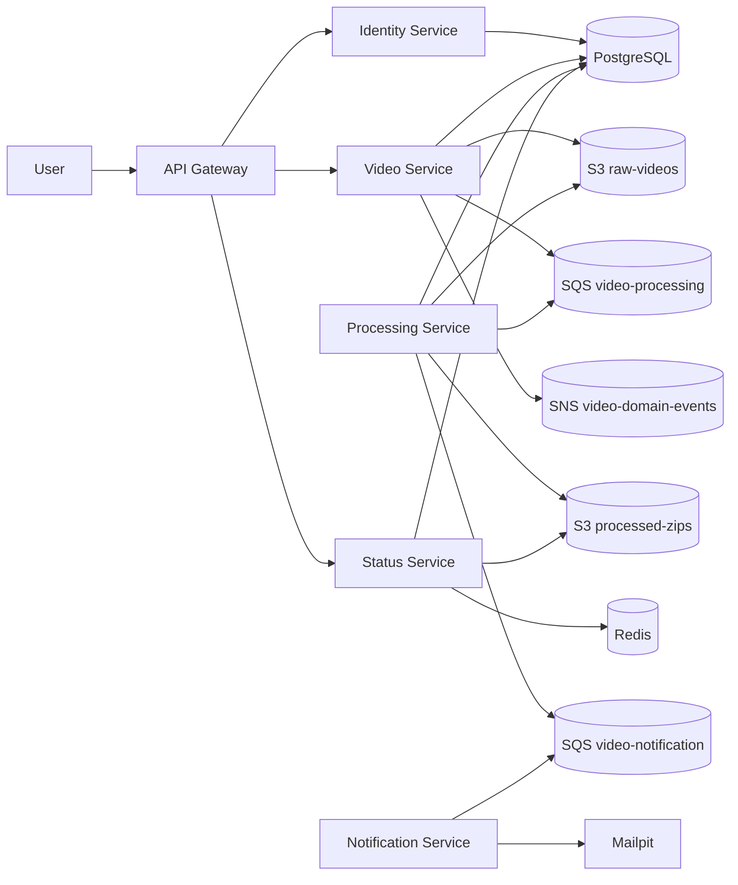

```mermaid
flowchart LR
  User[User] --> APIGW[API Gateway]
  APIGW --> ID[Identity Service]
  APIGW --> VID[Video Service]
  APIGW --> ST[Status Service]
  VID --> S3Raw[(S3 raw-videos)]
  VID --> SQSProc[(SQS video-processing)]
  VID --> SNS[(SNS video-domain-events)]
  PROC[Processing Service] --> SQSProc
  PROC --> S3Raw
  PROC --> S3Zip[(S3 processed-zips)]
  PROC --> SQSN[(SQS video-notification)]
  ST --> S3Zip
  NOTIF[Notification Service] --> SQSN
  NOTIF --> Mailpit[Mailpit]
  ID --> PG[(PostgreSQL)]
  VID --> PG
  PROC --> PG
  ST --> PG
  ST --> Redis[(Redis)]
```
