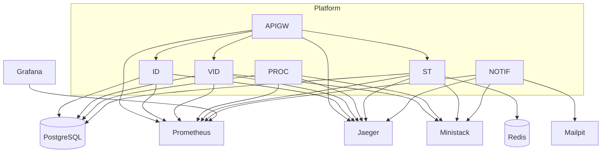

```mermaid
graph TD
  subgraph Platform
    APIGW
    ID
    VID
    PROC
    ST
    NOTIF
  end
  PG[(PostgreSQL)]
  REDIS[(Redis)]
  MINI[Ministack]
  PROM[Prometheus]
  GRAF[Grafana]
  JAEGER[Jaeger]
  MAIL[Mailpit]

  APIGW --> ID
  APIGW --> VID
  APIGW --> ST
  VID --> MINI
  PROC --> MINI
  ST --> MINI
  NOTIF --> MINI
  ID --> PG
  VID --> PG
  PROC --> PG
  ST --> PG
  ST --> REDIS
  NOTIF --> MAIL
  APIGW --> PROM
  ID --> PROM
  VID --> PROM
  PROC --> PROM
  ST --> PROM
  NOTIF --> PROM
  GRAF --> PROM
  APIGW --> JAEGER
  ID --> JAEGER
  VID --> JAEGER
  PROC --> JAEGER
  ST --> JAEGER
  NOTIF --> JAEGER
```
