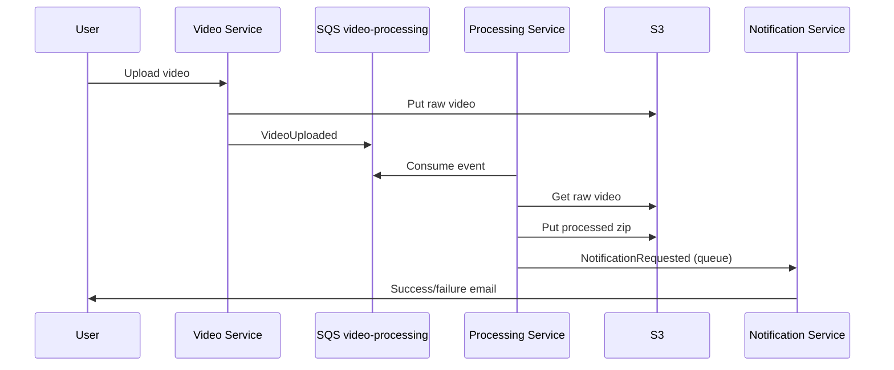

```mermaid
sequenceDiagram
  participant U as User
  participant VG as Video Service
  participant SQS as SQS video-processing
  participant PS as Processing Service
  participant S3 as S3
  participant NS as Notification Service

  U->>VG: Upload video
  VG->>S3: Put raw video
  VG->>SQS: VideoUploaded
  PS->>SQS: Consume event
  PS->>S3: Get raw video
  PS->>S3: Put processed zip
  PS->>NS: NotificationRequested (queue)
  NS->>U: Success/failure email
```
