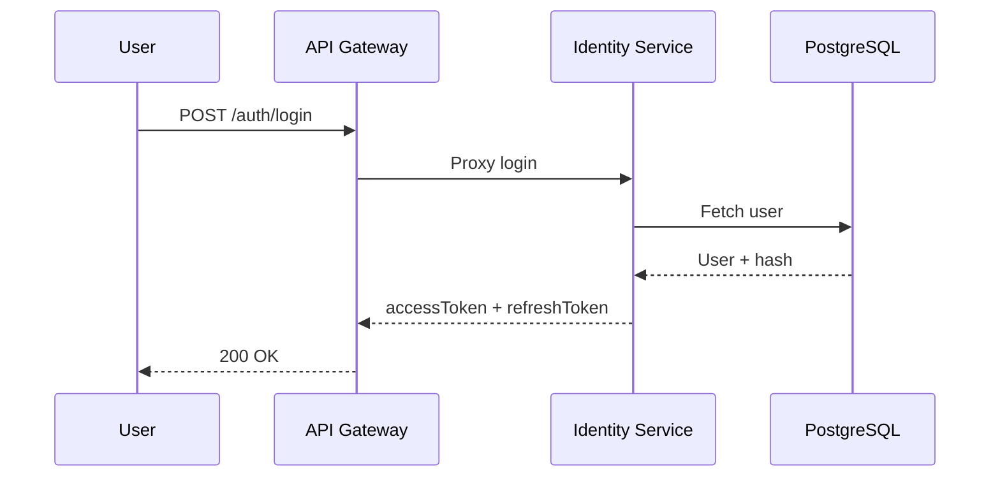

```mermaid
sequenceDiagram
  participant U as User
  participant GW as API Gateway
  participant ID as Identity Service
  participant DB as PostgreSQL

  U->>GW: POST /auth/login
  GW->>ID: Proxy login
  ID->>DB: Fetch user
  DB-->>ID: User + hash
  ID-->>GW: accessToken + refreshToken
  GW-->>U: 200 OK
```
