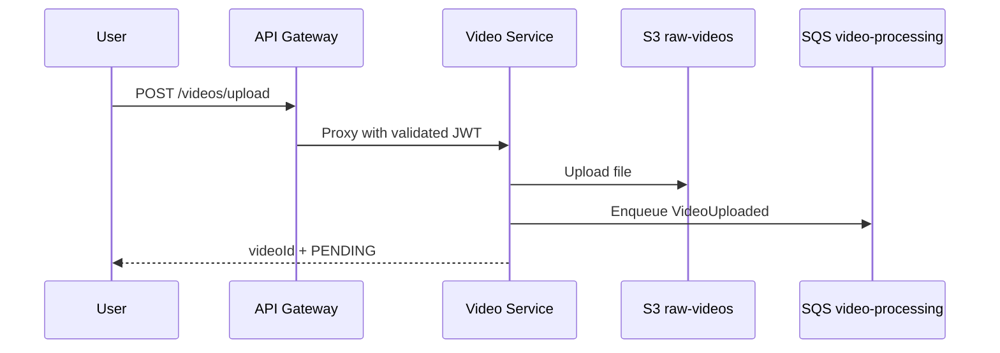

```mermaid
sequenceDiagram
  participant U as User
  participant GW as API Gateway
  participant VS as Video Service
  participant S3 as S3 raw-videos
  participant Q as SQS video-processing

  U->>GW: POST /videos/upload
  GW->>VS: Proxy with validated JWT
  VS->>S3: Upload file
  VS->>Q: Enqueue VideoUploaded
  VS-->>U: videoId + PENDING
```
