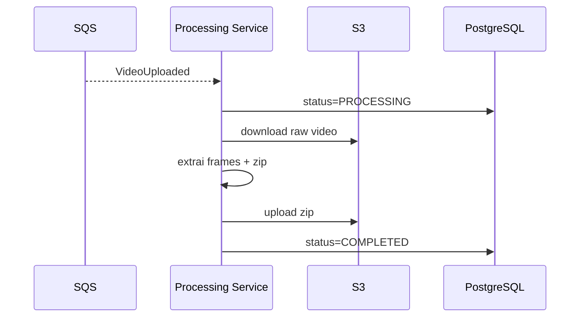

```mermaid
sequenceDiagram
  participant Q as SQS
  participant PS as Processing Service
  participant S3 as S3
  participant DB as PostgreSQL

  Q-->>PS: VideoUploaded
  PS->>DB: status=PROCESSING
  PS->>S3: download raw video
  PS->>PS: extrai frames + zip
  PS->>S3: upload zip
  PS->>DB: status=COMPLETED
```
