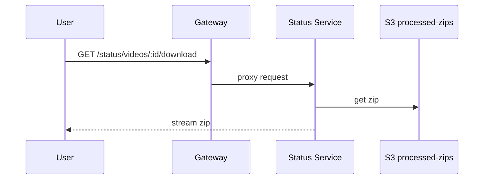

```mermaid
sequenceDiagram
  participant U as User
  participant GW as Gateway
  participant ST as Status Service
  participant S3 as S3 processed-zips

  U->>GW: GET /status/videos/:id/download
  GW->>ST: proxy request
  ST->>S3: get zip
  ST-->>U: stream zip
```
