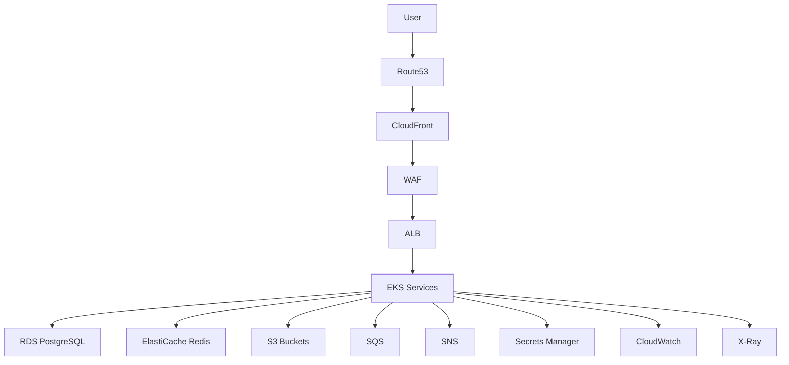

```mermaid
flowchart TD
  U[User] --> R53[Route53]
  R53 --> CF[CloudFront]
  CF --> WAF[WAF]
  WAF --> ALB[ALB]
  ALB --> EKS[EKS Services]
  EKS --> RDS[RDS PostgreSQL]
  EKS --> EC[ElastiCache Redis]
  EKS --> S3[S3 Buckets]
  EKS --> SQS[SQS]
  EKS --> SNS[SNS]
  EKS --> SM[Secrets Manager]
  EKS --> CW[CloudWatch]
  EKS --> XR[X-Ray]
```
