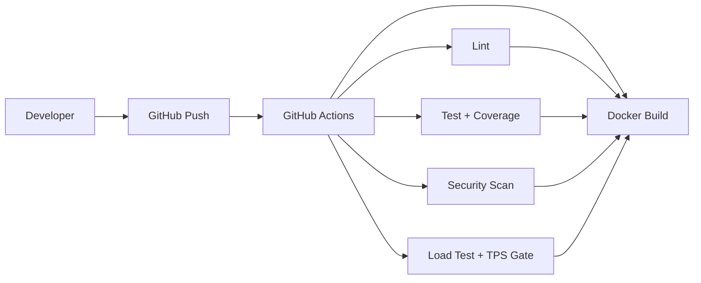

```mermaid
flowchart LR
  DEV[Developer] --> GH[GitHub Push]
  GH --> CI[GitHub Actions]
  CI --> LINT[Lint]
  CI --> TEST[Test + Coverage]
  CI --> SEC[Security Scan]
  CI --> PERF[Load Test + TPS Gate]
  CI --> BUILD[Docker Build]
  LINT --> BUILD
  TEST --> BUILD
  SEC --> BUILD
  PERF --> BUILD
```
